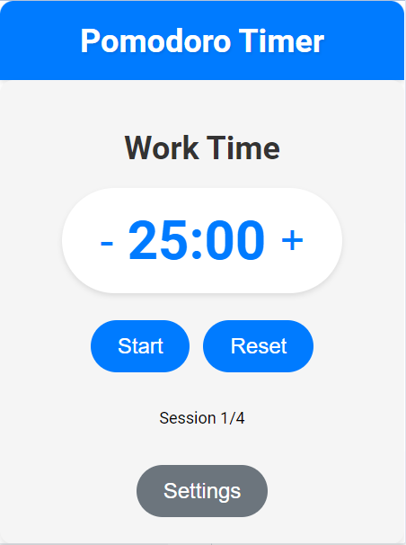
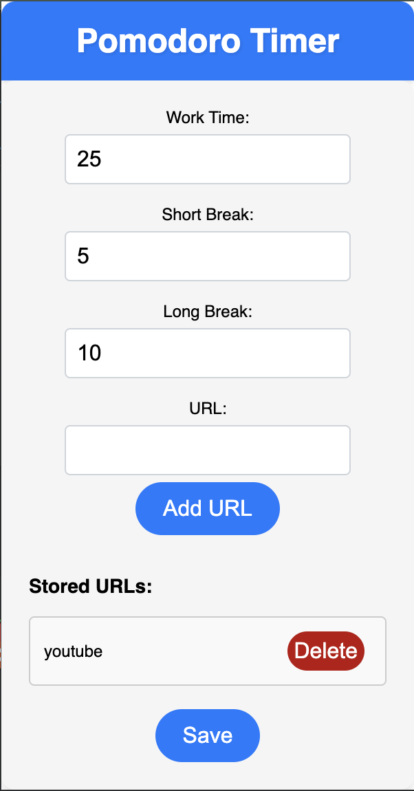
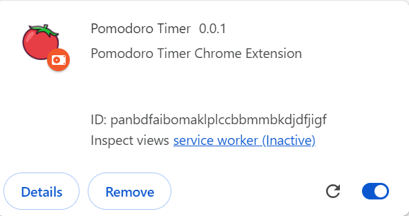

# Pomodoro Chrome Extension

## Table of Contents ✨

- [Description](#description)
- [Settings](#settings)
- [Installation](#installation)
- [Usage](#usage)
- [Features](#features)
- [Contributing](#contributing)
- [License](#license)

# Description

A simple Pomodoro Chrome Extension built with Next.js, React, and TypeScript. The Pomodoro Technique is a time management method that uses a timer to break down work into intervals, traditionally 25 minutes in length, separated by short breaks. This technique is used to improve productivity and focus by allowing you to work in short, focused bursts.



# Settings

The Pomodoro Extension allows you to customize the timer settings to suit your needs. You can set the length of the work interval, the length of the short break, and the length of the long break. You can also choose to enable or disable the sound notification when the timer is up.





# Installation

To install and use the Pomodoro Extension, follow these steps:

1. Clone the repository.
2. Install dependencies using `npm install`

# Usage

## Usage Locally 🔥

To run the Pomodoro Extension locally, follow these steps:

1. Start the development server:

   ```sh
   npm run dev
   ```

   This will run the project on your localhost.

2. Open [http://localhost:3000/](http://localhost:3000/) in your browser.

## Build and Import To Chrome 🔥

To build and import Pomodoro Extension Starter to chrome browser, follow these steps:

1. Build the project:

```sh
npm run build
```

This will run prep and export to create new folder 'out/', and rename '\_next' folder to 'next' (without underscore)

2. Open Google Chrome and go to chrome://extensions.

3. Enable the "Developer mode" toggle switch.

4. Click on "Load unpacked" and select the out folder generated by the build process.

5. The Pomodoro Extension should now be loaded as an unpacked extension in Google Chrome.

## Features

### Completed

- [x] Start a 25-minute timer
- [x] Start a 5-minute break
- [x] Start a 15-minute break
- [x] Start a custom timer
- [x] Add a settings page to customize the timer
- [x] Add a pause button
- [x] Add a reset button
- [x] Add website blocking while the timer is running
- [x] Add a countdown timer to show the time left

## Work in Progress

## Future Features

- [ ] Add a notification when the timer is up
- [ ] Add a sound when the timer is up
- [ ] Add a progress bar to show the time left
- [ ] Add a history page to show past timers
- [ ] Add a statistics page to show the number of pomodoros completed
- [ ] Add a dark mode
- [ ] Add a light mode
- [ ] Add a theme switcher

```

```

# Contributing

Contributions to the Pomodoro Extension are welcome! If you find any issues or have suggestions for improvements, please feel free to open an issue or submit a pull request.

# License

This project is licensed under the MIT License.
